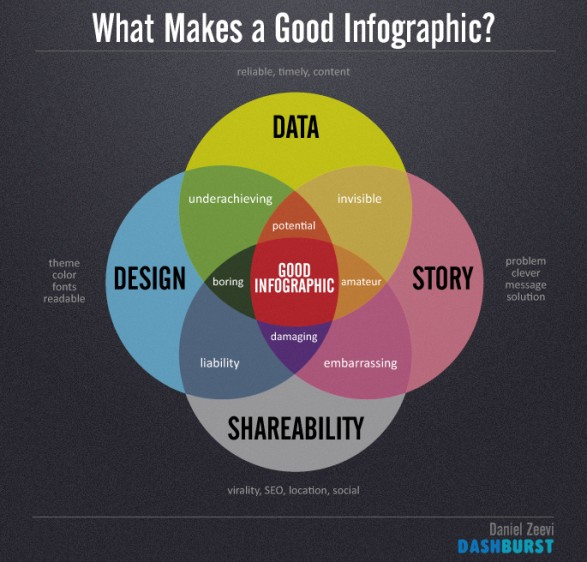
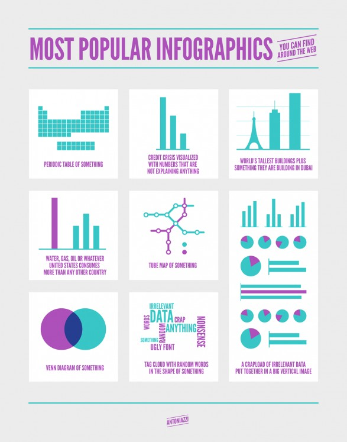

# Spreading Knowledge, One Infographic at a Time {#Infographic-Database}

#### Keywords

infographic, database, integrity, social media, knowledge, facts

## The Problem: The Underused Value of Research

Have you ever scrolled through your news feed to find an infographic displaying a few simple statistics that blow your mind? Social and political issues are often highlighted in this manner, for example a short video clip outlining information about women in the work place or average wage by ethnicity. These tidbits of tangible information shared in a simple and clean way are incredibly informative and eye-opening. If you could, wouldn't you want to have access to a tool that produces custom visualizations with valuable information on almost any topic you can imagine?

Governments across the world collect and publish large amounts of data every year, typically obtained through censuses or other pointed studies. This data is readily available online, but often comes in the form of hefty files or long-winded reports. Other bodies, such as business or non-profit organizations, also collect and publish valuable information that could positively impact education or decision making. Unfortunately, the insights from these datasets often don't make it past page three of a tab buried deep within an unassuming website.

```{r good-infographics,echo=FALSE,fig.cap='An infographic describing infographic best practices.',fig.align='center',out.width='50%'}

```

## The Solution: Research and Media Collide

I would like to take advantage of these datasets to produce an educational visualization database and search tool. The product will routinely read and process data posted by verifiable research bodies. Each data set will be tagged by topic using natural language processing, and then aggregated with data processed from other sources that covers the same subject. A variety of visualization styles or templates, including different types of charts, graphs, and phrases combined to form short video clips, pictures, or reports, will be constructed.

```{r infographic-types,echo=FALSE,fig.cap='A satirical infographic outlining a variety infographic types.',fig.align='center',out.width='50%'}

```

When users enter a search term into the tool, the system queries its database and returns results based on relevancy, credibility and popularity. The data sets returned by the query are matched to a visualization template using a set of best-practice rules and machine learning algorithms, and finally displayed to the user. From there, the user can interact with the search results in a number of ways, such as: scrolling through search results, viewing raw data sets, viewing information about the source of data, customizing visualization templates, and finally saving an infographic visualization to their desktop or posting to social media.

The tool would accumulate data covering a broad range of topics both serious and trivial, making it useful for boardrooms, classrooms, and living rooms alike. In addition to interacting with the tool as a public user, stakeholders such as governments, businesses, and nonprofits may submit datasets for consideration to be added to the database, or liscence the tool to directly process and visualize data internal to their organizations.

## Considerations: Separating Fact and Fallacy

There are a major considerations that will need to be solved. As effective an instructive tool as infographics may be, they are notorious for showing half-truths, using data to skew ideas, or citing unreliable sources. Each of these problems will need to be assessed and protected against to ensure the truth of the data is conveyed most accurately. This means verifying the source and scope of raw data, ensuring visualization algorithms uphold a standard of quality, as well as recognizing the stigmas and limitations attached to infographics as a visualization medium. In addition, users will need to be protected from polling data incorrectly or selecting inappropriate visualization templates when generating infographics. Algorithms to pull and process data must be safeguarded against accidental misuse or error. There is considerable work to be done to ensure the product is both effective and truthful.

```{r facebook-newsfeed,echo=FALSE,fig.cap='Social media giant Facebook struggles with fake news.',fig.align='center',out.width='50%'}

```

That being said, the product shows great potential at this preliminary stage. The tool will have the ability to be easily integrated with both formal reports and social media newsfeeds, or used directly in educational institutions and workplaces alike.  In addition to its entertainment value, the product provides an educational solution for people of any walk of life to visualize the reality of important topics such as politics or economics, which in turn allows truthful knowledge to disseminate through the greater public. This knowledge, as a result, has the potential to positively impact personal and public decision making.

The product will no doubt be a valuable tool that brings two existing worlds, media and research, together for the greater good. 
