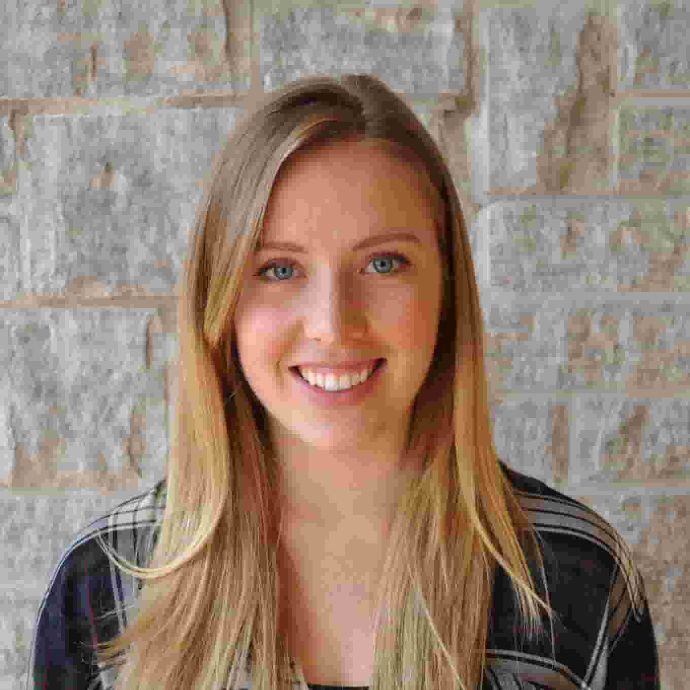

<!-- This won't be displayed but it will initialize your R session. Add any R libraries you need here. -->
```{r init,include=FALSE,echo=FALSE}
library(magrittr)
```


# Welcome! {-}

Hello! This is a collection of my three cool ideas for W201 Fall 2017.


### Abstract of my first cool idea

In the first cool idea, we look at compiling scientific study results into an easily accessible and structured database for public consumption.

### Abstract of my second cool idea

In the second cool idea, we look at harnessing the powers of social media and cellular networks to save lives during tropical storms or tornadoes.

## About the author {-}

Hi, my name is Kathryn and I'm a MIDS student at UC Berkeley. 

```{r portrait,echo=FALSE,fig.cap='This is me!',fig.align='center',out.width='50%'}

```

I grew up an avid downhill skiier, lover of basketball and volleyball, and aspiring mathematician in Calgary, Canada. Following the career path of both my parents, I went on to become an engineer: in June 2016 I graduated from Queen's University with a Bachelors Degree in Mathematics and Engineering.

Shortly after that, I moved to Michigan to join Ford Motor Company's autonomous vehicle group, where I currently work on reliability models, functional safety and other systems engineering projects.

In September 2017, I started MIDS and am looking forward to the next couple years of learning all about data!

*Updated: `r Sys.Date()`*
